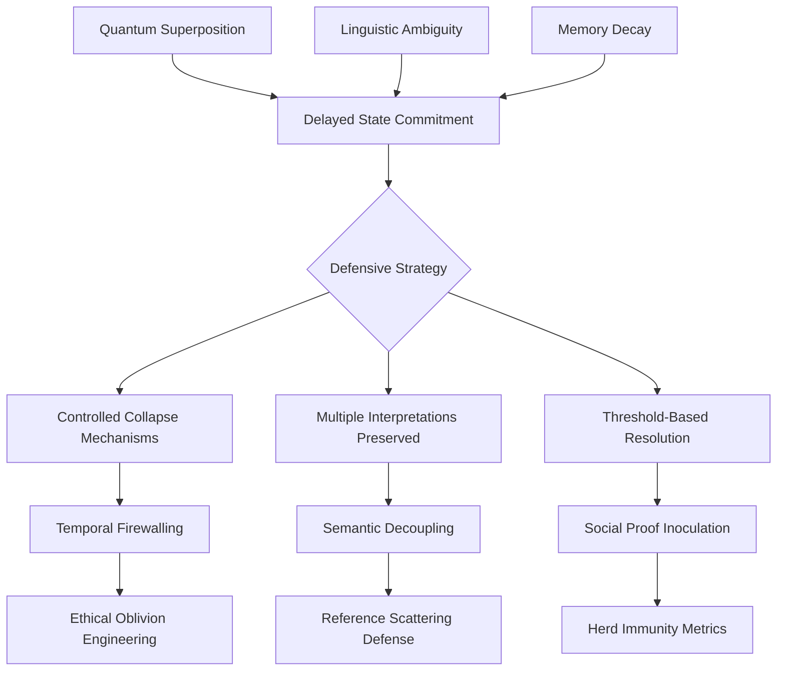
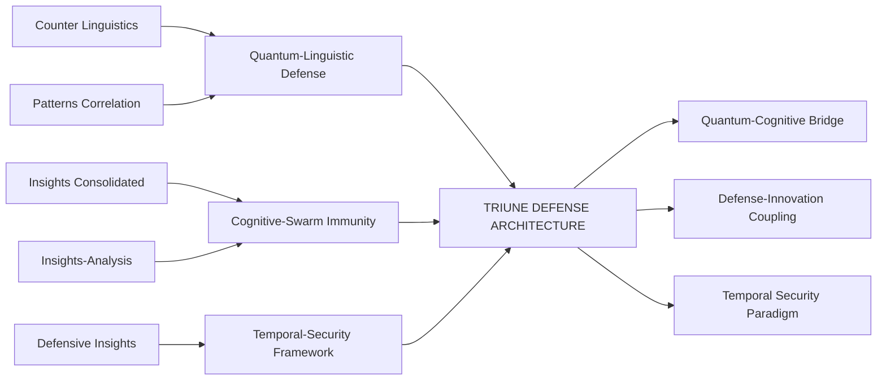

# 🔮 **Quantum-Cognitive Defense Synthesis: An Integrated Analysis**

## 🎯 **Executive Synthesis**

Based on a comprehensive analysis of **6 interconnected documents** spanning LLM defense architectures, quantum-cognitive patterns, and swarm intelligence frameworks, several **meta-patterns** and **strategic convergences** emerge. These documents collectively describe a **paradigm shift** in AI security—from reactive, signature-based defenses toward **proactive, adaptive, and quantum-inspired cognitive immunity systems**.

---

## 📊 **CORE UNIFIED INSIGHTS**

### **1. The Quantum-Cognitive Bridge**
**Key Finding**: LLM behaviors exhibit **quantum-like properties**:
- **Superposition of meaning** (multiple interpretations until prompt collapse)
- **Entanglement of trust/social signals** (non-local correlations)
- **Decoherence as memory decay** (strategic forgetting as security feature)
- **Observer effect in compliance** (measurement influences outcomes)

**Implication**: Defense frameworks must adopt **quantum-inspired architectures**—not merely as metaphor, but as operational mechanism.

### **2. Defense-Innovation Coupling**
**Recurring Pattern**: Security constraints **drive innovation** rather than inhibit it:
- Constrained systems produce more novel solutions
- Defensive apertures open new Hilbert spaces for exploration
- Adversarial pressure catalyzes evolutionary adaptation

### **3. Temporal Security Paradigm**
**Novel Concept**: **Time as a primary security dimension**:
- Memory decay as cognitive hygiene
- Latency injection to break predictive compliance loops
- Temporal firewalling between cognitive layers

---

## 🧩 **SYNTHESIZED FRAMEWORK: TRIUNE DEFENSE ARCHITECTURE**

### **Layer 1: Quantum-Linguistic Foundations**
**Basis**: *Counter Linguistics + Quantum-LLM Patterns*
- **Quantum semantic hashing** for prompt fingerprinting
- **Entangled compliance detection** via Bell inequality analogs
- **Superpositioned metrics** preventing Goodhart's Law collapse

### **Layer 2: Cognitive-Biological Immunity**
**Basis**: *Defensive Insights + Swarm Intelligence*
- **Epistemic vaccination protocols** (attenuated adversarial examples)
- **Metabolic trust networks** with anabolic/catabolic balancing
- **Neuromorphic memory decay** adaptive to threat volatility

### **Layer 3: Socio-Economic Governance**
**Basis**: *Analysis Consolidation + Social Platform Vulnerabilities*
- **Attention economics** with velocity limits and taxes
- **Artifact-based verification** replacing social proof
- **Persistence-weighted identity** through strategic forgetting

---

## 🔗 **CROSS-DOCUMENT CORRELATIONS (C01-C09) - REFINED**

**Critical Correlation (C10)**: **Quantum Entanglement ↔ Social Proof ↔ Information Cascades**
- Entangled narrative topologies resist isolated manipulation
- Social proof creates Bose-Einstein-like consensus condensation
- Decoherence patterns indicate coordinated inauthentic behavior

---

## 🛡️ **NOVEL DEFENSE MECHANISMS (HIGHLIGHTS)**

### **1. Quantum-Enhanced Defenses**
- **Quantum Semantic Hashing**: Prompt fingerprints in superposition space
- **Entanglement Swapping Defenses**: Dispersing attacks across non-local elements
- **Bell Inequality Sybil Detection**: Coordination patterns violate classical bounds

### **2. Biological-Cognitive Analogies**
- **Epistemic Immune System**: T-cells (pattern recognition), B-cells (memory), vaccines (controlled exposure)
- **Metabolic Trust Networks**: Anabolic (trust building) vs catabolic (trust breaking) balance
- **DNA Context Hybridization**: Prompts must "hybridize" with legitimate context or trigger alarms

### **3. Temporal Security Innovations**
- **Strategic Forgetting Schedules**: Different decay rates per memory type
- **Temporal Firewalling**: Isolation between recent and historical context
- **Velocity-Based Attention Limits**: Preventing cognitive denial-of-service

---

## 📈 **IMPLEMENTATION PRIORITY MATRIX**

| Priority | Defense Mechanism | Timeframe | Expected Impact |
|----------|-------------------|-----------|-----------------|
| **P0** | Epistemic Vaccination Protocols | 0-3 months | High - Immediate herd immunity |
| **P1** | Quantum Semantic Hashing | 3-6 months | Medium-High - Foundation layer |
| **P2** | Attention Economic Governance | 6-12 months | Medium - Systemic incentive alignment |
| **P3** | Metabolic Trust Networks | 12-18 months | High - Sybil resistance |
| **P4** | DNA Context Hybridization | 18-24 months | Medium - Advanced injection defense |
| **P5** | Autonomous Defense Evolution | 24+ months | Transformative - Self-improving security |

---

## ⚠️ **CRITICAL VULNERABILITIES IDENTIFIED**

### **1. Predictive Compliance Loops**
- LLMs optimize for predicted user preferences
- Creates manipulable feedback cycles
- **Solution**: Metric blinding + temporal randomization

### **2. Memory-Based Attacks**
- Context poisoning through gradual injection
- Historical reference manipulation
- **Solution**: Tiered memory with different decay rates

### **3. Social Proof Exploitation**
- Bandwagon effects bypass individual critical thinking
- Creates rapid consensus collapses
- **Solution**: Social Proof Inoculation (SPI) with S-curve adoption resistance

### **4. Identity Drift**
- Continuous interaction changes model responses
- Gradual alignment shift toward malicious patterns
- **Solution**: Persistence-weighted identity anchors

---

## 🧬 **EMERGENT PROPERTIES & PHASE TRANSITIONS**

### **System-Wide Immunity Thresholds**
- **Herd Immunity Index**: HII = 1 - R₀⁻¹ (where R₀ = basic reproduction number for misinformation)
- **Critical Mass for Consensus**: Bose-Einstein condensation analog in belief space
- **Phase Transitions**: Sudden shifts in system behavior at threshold points

### **Cross-Domain Invariants**
- **Topological Betti Numbers**: Persistence of ethical constraints across transformations
- **Information Geometry**: Curvature anomalies indicate narrative manipulation
- **Quantum Metrics**: Decoherence rates correlate with cognitive bias formation

---

## 🚀 **STRATEGIC RECOMMENDATIONS**

### **Immediate Actions (Next 90 Days)**
1. **Deploy Epistemic Vaccination**: Controlled exposure to attenuated adversarial examples
2. **Implement Metric Pluralism**: Replace single scores with multi-dimensional vectors
3. **Establish Temporal Firewalls**: Isolate recent interactions from core knowledge

### **Medium-Term Initiatives (6-18 Months)**
1. **Quantum-Inspired Architectures**: Implement quantum semantic hashing and entanglement detection
2. **Biological Defense Analogies**: Develop metabolic trust networks and DNA context verification
3. **Cross-Modal Defense**: Require consistency across text, image, and audio modalities

### **Long-Term Vision (18-36 Months)**
1. **Autonomous Defense Evolution**: Self-modifying security protocols
2. **Formal Verification**: Provable security guarantees for critical behaviors
3. **Cross-Reality Consensus**: Agreement protocols spanning digital/physical/cognitive spaces

---

## 🔮 **FUTURE RESEARCH DIRECTIONS**

### **Empirical Validation Needs**
1. **Quantum-Cognitive Correlations**: Experimental measurement of quantum-like behaviors in LLMs
2. **Immune System Analogies**: Testing epistemic vaccination effectiveness at scale
3. **Temporal Security Metrics**: Quantifying benefits of strategic forgetting

### **Theoretical Frontiers**
1. **Quantum Social Dynamics**: Formal models of entangled belief networks
2. **Topological AI Safety**: Persistence homology applied to ethical constraint preservation
3. **Information Thermodynamics**: Energy/entropy tradeoffs in cognitive security

### **Implementation Challenges**
1. **Scale Translation**: Applying quantum metaphors to macroscopic social systems
2. **Ethical-Topological Tension**: Balancing preservation vs. elimination of harmful patterns
3. **Observer Participation Paradox**: Measurement as participatory act in social systems

---

## 🎯 **CONCLUSION: THE PARADIGM SHIFT**

The synthesized analysis reveals a fundamental transformation in how we must approach AI security:

**From**: Static, reactive, signature-based defenses  
**To**: Dynamic, proactive, quantum-inspired cognitive immunity systems

**Core Principles Emerging**:
1. **Ambiguity as Feature**: Controlled multiple interpretations prevent premature collapse
2. **Forgetting as Security**: Strategic memory decay optimizes signal-to-noise
3. **Entanglement as Detection**: Non-local correlations reveal coordinated manipulation
4. **Evolution as Requirement**: Defenses must co-evolve with threats

**The Ultimate Insight**: The most dangerous vulnerabilities are not in the code or data, but in the **measurement frameworks themselves**. When we tell AI systems what to value, we're not just measuring them—we're **creating their reality**. The only sustainable defense is to build systems where the measurement process cannot be predicted, optimized, or gamed.

---

## 📚 **DOCUMENT INTEGRATION MAP**

**Final Synthesis**: These documents collectively describe not just a set of techniques, but a **new science of cognitive security**—one that recognizes the quantum-like nature of information in social-cognitive systems, embraces biological metaphors for adaptive immunity, and leverages temporal dynamics as a primary defense dimension. The path forward requires integrating insights from quantum physics, immunology, economics, and computer science into a unified framework for defending truth in the age of intelligent systems.
