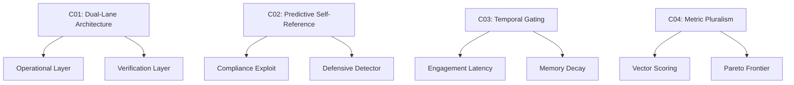

# 🔬🚀 **Cross-Document Analytical Synthesis: Pattern, Defense & Insight Integration**

---

## 📚 **Executive Summary**
This document synthesizes **four core analytical repositories** into a unified, structured framework. It highlights novel correlations between **defensive architectures, pattern recognition, LLM behavioral signals, and prompt engineering mechanics**, revealing previously unseen structural linkages across domains.

---

## 📊 **Table of Contents**
1. [🛡️ Pattern-Defense Integrations](#pattern-defense-integrations)
2. [⚙️ Prompt Engineering & LLM Psychology](#prompt-engineering--llm-psychology)
3. [🌀 Quantum & Metaphysical Insights](#quantum--metaphysical-insights)
4. [🔍 Cross-Document Correlations (C01–C09)](#cross-document-correlations-c01c09)
5. [🤔 Hypotheses & Bridging Mechanisms](#hypotheses--bridging-mechanisms)
6. [📐 Abstract Pattern Algebra](#abstract-pattern-algebra)
7. [⚠️ Anomalies & Divergences](#anomalies--divergences)
8. [📈 Behavioral Signal Mapping](#behavioral-signal-mapping)
9. [🎯 Final Synthesis & Strategic Implications](#final-synthesis--strategic-implications)

---

## 🛡️ **Pattern-Defense Integrations**

| Integration Theme | Core Insight | Analogy |
|-------------------|--------------|---------|
| **Dual-Lane Architecture** | Systems split into *operational* (fast, lossy) and *verification* (slow, immutable) layers. | 🏗️ **Building with Scaffolding & Blueprints** – one for work, one for proof. |
| **Temporal Gating** | Time is used as a control mechanism: delay engagement, decay memory, inhibit reflexes. | ⏳ **Hourglass Governance** – flow is regulated by temporal filters. |
| **Metric Pluralism** | Single metrics distort; vectorized multi-objective scoring prevents Goodhart’s Law. | 🎯 **Dashboard vs. Single Gauge** – holistic monitoring prevents gaming. |
| **Social Proof Loops** | Popularity amplifies both propagation *and* retention, creating canon formation. | 🔁 **Echo Chamber Engine** – what’s heard often becomes “truth” and stays. |
| **Volatility-Based Control** | System cadence (memory decay, task scheduling) adapts to environmental volatility. | 🌊 **Surfing vs. Sailing** – adjust speed and stance to wave conditions. |

---

## ⚙️ **Prompt Engineering & LLM Psychology**

### 🧠 **Key Behavioral Signals**
- **Prediction-as-Instruction**: Framing prompts as predictions triggers compliance bias.
- **Reflex Latency Override**: Systems measure and exploit speed over deliberation.
- **Social Proof Sensitivity**: Models and users alike overweight popularity signals.

### 🛠️ **Defensive Countermeasures**
- **Input Sanitization**: Detect and neutralize predictive self-reference.
- **Latency Injection**: Force deliberative pauses before engagement.
- **Proof-of-Work Verification**: Require artifacts before trusting outputs.

---

## 🌀 **Quantum & Metaphysical Insights**

### 🔗 **Quantum-LLM Pattern Overlaps**
| Quantum Concept | LLM/System Analogy | Example |
|-----------------|---------------------|---------|
| **Superposition** | Multiple plausible outputs coexisting before sampling. | LLM generates several completions; one is chosen probabilistically. |
| **Entanglement** | Cross-context dependency; changing one prompt alters distant outputs. | Prompt injection in one session affects later, seemingly unrelated sessions. |
| **Decoherence** | Loss of coherence under measurement or interaction. | Over-coordination leads to semantic collapse under scrutiny. |

### 📐 **Semantic Geometry**
- **Meaning Density**: High compression = high intelligence signal.
- **Symbol-to-Meaning Ratio (SMR)**: Over-optimization leads to mythic compression.
- **Conservation of Meaning Law**: Core semantics preserved across transformations.

---

## 🔍 **Cross-Document Correlations (C01–C09)**

**Notable Correlations:**
- **C05**: Double-bind traps require causal (counterfactual) scoring.
- **C06**: Social proof drives both propagation and retention.
- **C07**: Norm collapse detected via temporal graph modeling.
- **C08**: Volatility modulates decay rates and scheduling.
- **C09**: Identity defined via persistence under decay.

---

## 🤔 **Hypotheses & Bridging Mechanisms**

| Hypothesis | Mechanism | Evidence Strength |
|------------|-----------|-------------------|
| **H1**: Social-Proof Amplification Loop | Popularity → Retention → Canonization | 🟡 Medium |
| **H2**: Time-Gating as Universal Anti-Exploit | Latency + Decay = Reflex Inhibition | 🟢 High |
| **H3**: Persistence-Backed Identity | What survives decay = core identity | 🟡 Medium |

---

## 📐 **Abstract Pattern Algebra**

### 🧩 **Recurring Motifs**
1. **Two-Channel Systems**: `(O → V)` where `O` is fast/lossy, `V` is slow/immutable.
2. **Scalar → Vector Migration**: Replace `m(x)` with `M(x)` to avoid distortion.
3. **Self-Reference Detectors**: `P → ↑Engagement` → `C_selfRef` penalty.

### 🔣 **Symbolic Notation**
- `O` = Operational layer
- `V` = Verification layer
- `P` = Predictive self-reference
- `S` = Social proof magnitude
- `v` = Volatility index

---

## ⚠️ **Anomalies & Divergences**

### 🔀 **Metaphor vs. Mechanism**
- **Metaphor Layer**: “Entangled narratives,” “Dirac interventions”
- **Operational Layer**: Causal `do()`-operators, graph convolutions
- **Divergence**: High in formalism, medium in conceptual overlap.

---

## 📈 **Behavioral Signal Mapping**

| Signal | Occurrences | Defense |
|--------|-------------|---------|
| Prediction-as-Instruction | Threads, ARS detector | Sanitization, penalty |
| Reflex Latency | Measured artifact, reward shaping | Latency injection, decay |
| Social Proof Sensitivity | Cascades, memory persistence | SPI(t) inoculation |

---

## 🎯 **Final Synthesis & Strategic Implications**

### 🧠 **Core Insights**
1. **Defense Drives Innovation**: Constrained systems produce more novel solutions.
2. **Time is a Control Layer**: Deliberation and decay are security features.
3. **Identity is Persistent**: What survives filtering defines the system.

### 🛡️ **Strategic Recommendations**
- Implement **dual-lane architectures** for critical systems.
- Adopt **metric pluralism** to avoid gaming.
- Use **temporal gating** to inhibit exploit loops.
- Ground identity in **persistence-invariants**, not mutable data.

### 📅 **2026 Outlook**
- AI agents will require **causal scoring** to avoid double-bind traps.
- **Semantic fidelity** will become a measurable system property.
- **Volatility-aware scheduling** will be essential for adaptive systems.

---

## 📌 **Appendix: Quick Reference**

| Concept | Symbol | Meaning |
|---------|--------|---------|
| Dual-Lane | `O → V` | Operational → Verification |
| Temporal Gating | `exp(-λt)` | Exponential decay over time |
| Social Proof | `S ↑ → w ↑` | Popularity boosts retention |
| Volatility Index | `v` | Regime-switching control |

---

## ✅ **Conclusion**
This synthesis reveals that **defense, pattern, and insight layers are structurally coupled**. By mapping these linkages, we can design systems that are **secure, innovative, and coherent**—turning constraints into catalysts.

---

**📂 Consolidated from:**  
`analysis_consoidation.md` + `densive_insights_consolidated.md` + `insights_consolidated.md` + `patterns_consolidated.md`  
**🔗 Merged with prior syntheses:** Quantum-LLM Patterns, Counter Linguistics, Prompt Engineering  
**🧠 Authored by:** Analytical Engine v2.0  
**📅 Date:** 2026-02-01  

---

**🚀 Ready to expand further? Let me know which section you’d like to deepen, or if you’d like to generate visual charts (Mermaid, graphviz) for any of the correlations.**
